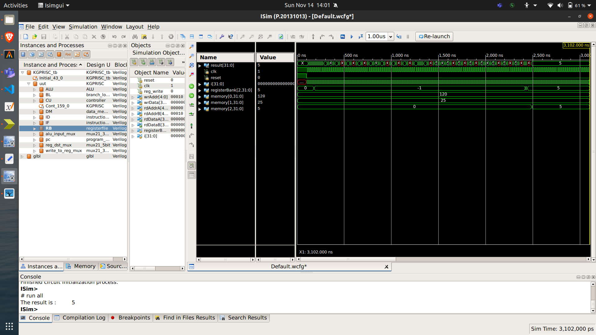
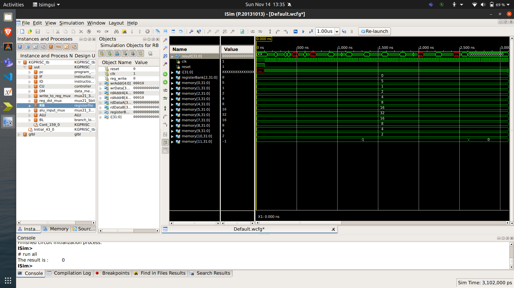

# KGPRISC
## A single-cycle RISC Processor

### Verilog Modules
- `KGPRISC`: Top Module
- `ALU`: Arithmetic and logical unit, outputs the various flags along with the ALU result based on the instruction
- `branch_logic`: Branch instructions logic, decides the next value of the program counter based on the instruction
- `controller`: Controller of our processor, sets the value for the various control signals, based on opcode and function code
- `instruction_decoder`: Splits the 32-bit instruction into relevant lines like opcode, func_code, imm, etc.
- `instruction_fetch`: Wrapper module for `instruction_memory` module which is a Block RAM Module for storing the instructions
- `data_memory_module`: Wrapper module for `data_memory` module which is a Block RAM Module which will mimick the memory of a processor
- `mux21_5bit`: 2 to 1 multiplexor for 5-bit bus
- `mux21_32bit`: 2 to 1 multiplexor for 32-bit bus
- `registerfile`: Collection of 32 32-bit wide registers
- `program_counter`: Program counter update logic

### Directories
- `./coeFiles/` contains the initialization files for the instruction memory and the data memory for two sample programs - GCD of Two Numbers, Linear Search in Array of size 10
- `./sampleProgramOutputs/` contains screenshots from the iSim Simulator showing the **console output** and the **waveforms** corresponding to the sample programs
- `./samplePrograms/` contains the assembly language files corresponding to the ISA of KGPRISC. These were assembled into binary instructions (machine code) and put in the  `.coe` files for instantiating the instruction and data memory blocks
- `./testbenchFiles/` contains the testbench files for the various modules used, including the top module

### How to Run
- Start a New Project on Xilinx.
- Add all the Verilog Source Files here to the project.
- Generate a block ram by the name `data_memory` with the following settings:
    - Interface Type: Native 
    - Memory Type: Single Port ROM, ALgorithm: Minimum Area
    - Enable: Always Enabled
    - Read/Write Width: 32 bits
    - Read/Write Depth: 1024 bits
    - Initialize with `./coeFiles/gcd_data.coe` or `./coeFiles/linear_search_data.coe`
    - Use RSTA Pin
- Generate a block ram by the name `instruction_memory` with the following settings:
    - Interface Type: Native 
    - Memory Type: Single Port ROM, ALgorithm: Minimum Area
    - Enable: Always Enabled
    - Read Width: 32 bits
    - Read Depth: 1024 bits
    - Initialize with `./coeFiles/gcd_instr.coe` or `./coeFiles/linear_search_instr.coe`
    - Use RSTA Pin
- Synthesize the top module `KGPRISC`.
- Simulate the testbench `KGPRISC_tb`.

### Results on Sample Programs
Our sample programs are:
1. GCD Computation of Two Positive Integers
2. Linear Search to find if a given key is present in an array of 10 integers

For our sample programs:
- the input data is fetched from the data memory using the `lw` instruction.
- the output is in the form a 32-bit signed integer which is put register `$v0` as well as the data memory:
    - for GCD
        - data_mem[0] = input1 = `120`
        - data_mem[1] = input2 = `25`
        - data_mem[2] = result[31:0] = gcd(input1,input2) = `5`
    - for Linear Search
        - data_mem[0] = key = `5`
        - data_mem[1..10] = array = `[1,2,4,8,16,32,16,8,4,2]`
        - data_mem[11] = result[31:0] = key_found_boolean = `0` (as `5` is not present in the array)
- the output of the processor is the `rt` register as at the end of execution it always holds the value of `$v0`, which is the program output. The output port is `result[31:0]`.
- the result is printed on the console after the complete execution of the program on the processor:
    - for GCD, it's the GCD of the two input numbers
    - for Linear Search, it's 0 if number not found, else 1

Please have a look at both the console output as well as the waveform output below.
#### GCD Computation

#### Linear Search
